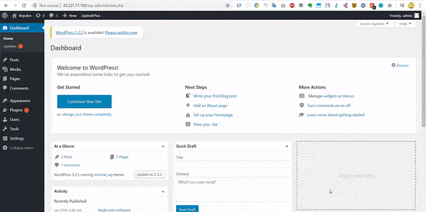
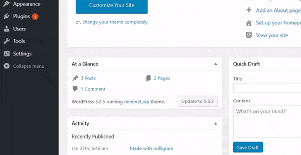

# Clock-loader

---

Some websites loads quicker than other, and some of them takes forever to load. So users have to see that boring white page. No matter how efficiently you code the website or how performant your servers are, there will be always some delay between user clicking on the url and website fully rendering on the screen. Between this delay browser displays a blank white page to the user, which is boring.

So you can change this by activating this awesome plugin. This is a small wordpress plugin that displays a clock styled loader until the website content fully loaded and is ready to display. This can keep the user engaged until the website load, so they don't feel bored.

---

## Installing

**You can download repository as a zip file and then extract all the content the repository in `wp-content/plugins` folder and then enabling the plugin inside your `wp-admin` dashboard.**

**Or you can directly clone the repository by following steps**

- Inside your `wordpress` root folder, run this command

  ```bash
  cd ./wp-content/plugins
  ```

- Then clone the repository

  ```bash
  sudo git clone https://github.com/Reepulse/clock-loader.git
  ```

- Then login to your `wp-admin` dashboard

- Then go to `installed plugins` and activate the `clock loader` plugin


> cloning the repository using git (you must have git installed)



> Activating the plugin

---

## Customizing

**You can change the background and clock color in plugin settings**

- On your `wp-admin` dashboard
- Click on `settings`
- Then click `Clock Loader Settings`
- Customize accordingly and then press `save`



> Customizing the plugin

---

